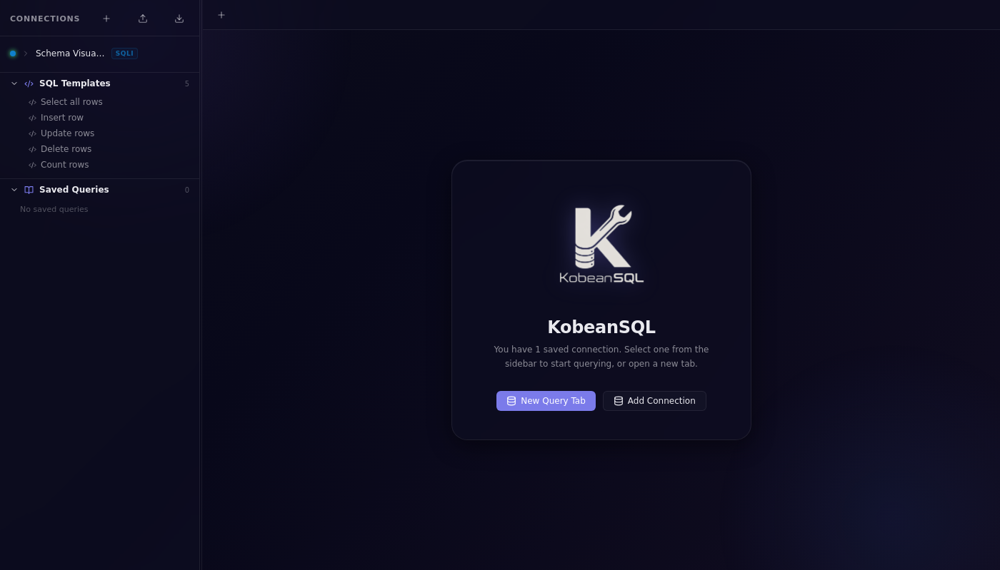
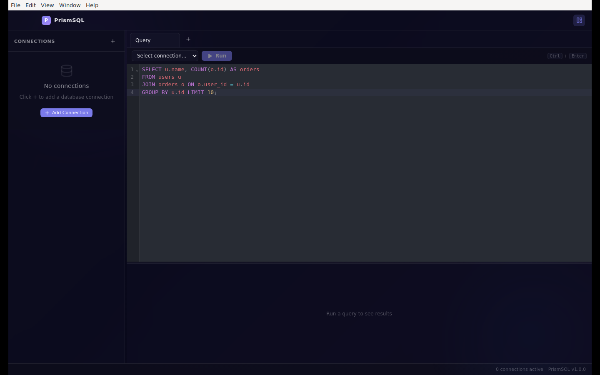

# KobeanSQL

> A cross-platform desktop SQL client that lets developers query, explore, and manage MySQL, MariaDB, PostgreSQL, SQLite, and SQL Server databases from a single, beautiful native app — no browser, no cloud, no data leaving your machine.

[](https://github.com/kobenguyent/KobeanSQL/actions)
[](https://github.com/kobenguyent/KobeanSQL/releases/latest)
[](https://www.electronjs.org/)
[](LICENSE)

---

## 📸 Screenshots

### Add connection flow — test connection successfully, then save


### Querying data flow — run queries successfully and view results


### SQL editor flow — compose and run SQL


---

## ✨ Key Features

### Connection Management
- **Multi-database support** — MySQL, MariaDB, PostgreSQL, SQLite, SQL Server (MSSQL) from a single UI
- **Connection tester** — validate host/port/credentials before saving, with a clear success/error banner
- **Persistent connections** — saved across app restarts; stored in your OS user-data directory
- **Connection import / export** — portable JSON backup and restore with validation, duplicate detection, and selective password inclusion
- **Per-connection server version display** — see the exact server version in the status bar once connected

### Query Editor
- **Multi-tab query editor** — open independent SQL tabs per connection; `Ctrl/⌘+T` creates a new tab
- **CodeMirror 6 engine** — SQL syntax highlighting, bracket matching, and intelligent autocompletion powered by `@codemirror/lang-sql`
- **One-click SQL beautify** — format messy SQL with `sql-formatter` directly from the toolbar
- **KobeanSQL SQL DSL** — dialect-aware query builders for `SELECT`, `CALL`, `EXEC`, and functions; inserts boilerplate SQL so you start from a correct template, not a blank slate
- **Keyboard shortcut execution** — `Ctrl/⌘+Enter` runs the current query

### Data Visualization & Results
- **Sortable, filterable results grid** — powered by `@tanstack/react-table` with global full-text filter and column-level sort
- **CSV export** — export the current result set to a `.csv` file in one click
- **Row count + query duration** — shown in the results panel footer after every execution
- **Database Schema Visualizer** — interactive entity-relationship diagram (built with `@xyflow/react` and `@dagrejs/dagre`) that auto-lays out tables and foreign-key relationships for the selected database

### Schema Browser
- **Expandable sidebar tree** — Connections → Databases → Tables/Views → Columns with data type and primary-key flags
- **Stored procedures / functions** — browse and call routines from the sidebar
- **Resizable layout** — drag the sidebar and results-panel dividers to fit your workflow

### Local AI (Privacy-First)
- **Local-only AI assistant** — Generate, explain, and optimize SQL using your own Ollama or OpenAI-compatible local server; zero cloud calls
- **No telemetry** — prompts and SQL never leave your machine

### Native Desktop Advantages (Electron-specific)
- **OS-native credential encryption** — passwords are encrypted at rest using Electron's `safeStorage` API (AES-256 backed by the OS keychain / DPAPI / libsecret)
- **macOS vibrancy & Windows 11 acrylic** — true native translucency using `vibrancy: 'under-window'` and `backgroundMaterial: 'acrylic'`
- **Offline-first** — all connections are direct TCP/IP; no proxy server required
- **Saved queries library** — store frequently used SQL snippets locally, categorized and searchable
- **Configurable query limit** — prevent runaway full-table scans by setting a global default row limit (1–10,000)

---

## 🗄️ Supported Databases

| Database     | Driver            | Default Port |
|--------------|-------------------|--------------|
| MySQL        | `mysql2`          | 3306         |
| MariaDB      | `mysql2`          | 3306         |
| PostgreSQL   | `pg`              | 5432         |
| SQLite       | `better-sqlite3`  | — (file)     |
| SQL Server   | `mssql`           | 1433         |

---

## 🏗️ Architecture & Tech Stack

### Electron Process Model

KobeanSQL strictly follows Electron's two-process architecture with `contextIsolation: true` and `nodeIntegration: false` — the renderer process has **no direct access** to Node.js APIs.

```
┌──────────────────────────────────────────────────────────┐
│  Main Process (Node.js + Electron)                       │
│                                                          │
│  ┌─────────────────────┐   ┌──────────────────────────┐ │
│  │  ConnectionManager  │   │  store.ts                │ │
│  │  (pooling, routing) │   │  (JSON persistence +     │ │
│  │                     │   │   safeStorage encrypt)   │ │
│  │  ┌──────────────┐   │   └──────────────────────────┘ │
│  │  │ MySQLAdapter │   │   ┌──────────────────────────┐ │
│  │  │ PGAdapter    │   │   │  AI Service              │ │
│  │  │ SQLiteAdapter│   │   │  (Ollama / OpenAI-compat)│ │
│  │  │ MSSQLAdapter │   │   └──────────────────────────┘ │
│  │  └──────────────┘   │   ┌──────────────────────────┐ │
│  └─────────────────────┘   │  electron-log            │ │
│                             │  (file transport)        │ │
│  IPC handlers registered    └──────────────────────────┘ │
│  via registerIpcHandlers()                               │
└───────────────────────┬──────────────────────────────────┘
                        │  IPC (ipcMain / ipcRenderer)
┌───────────────────────▼──────────────────────────────────┐
│  Preload Script (contextBridge)                          │
│                                                          │
│  Exposes window.db — a typed API surface with methods    │
│  like connect(), query(), getTables(), runAITask() etc.  │
│  No Node APIs are directly accessible in the renderer.  │
└───────────────────────┬──────────────────────────────────┘
                        │  window.db.*
┌───────────────────────▼──────────────────────────────────┐
│  Renderer Process (React + Vite, sandboxed)              │
│                                                          │
│  Zustand + Immer state  ←→  React components             │
│  ┌────────────┐  ┌──────────────┐  ┌─────────────────┐  │
│  │ Sidebar    │  │ QueryEditor  │  │  ResultsTable   │  │
│  │ (schema    │  │ (CodeMirror) │  │  (@tanstack/    │  │
│  │  browser)  │  │              │  │   react-table)  │  │
│  └────────────┘  └──────────────┘  └─────────────────┘  │
└──────────────────────────────────────────────────────────┘
```

**Main Process responsibilities:**
- Opening and managing all database TCP/IP connections (via `ConnectionManager`)
- Encrypting and persisting connection configs and saved queries to the local filesystem
- Registering all IPC handlers (`ipcMain.handle`) that the renderer calls via `window.db`
- AI task dispatch to local providers (Ollama, OpenAI-compatible)
- Window lifecycle, native menu, and OS-level events

**Renderer Process responsibilities:**
- All UI rendering and user interaction (React 18 component tree)
- Local application state — active tabs, selected connection, results — managed by Zustand + Immer
- SQL editor state (CodeMirror 6 view state, multi-tab)
- Calling `window.db.*` methods exposed by the preload bridge; never talking directly to database drivers

### Core Tech Stack

| Layer          | Technology                              | Version |
|----------------|-----------------------------------------|---------|
| Shell          | Electron                                | 29      |
| Build          | electron-vite + Vite                    | 2 / 5   |
| UI             | React + TypeScript                      | 18 / 5  |
| Styling        | Custom CSS (glassmorphism design system)| —       |
| State          | Zustand + Immer                         | 4 / 10  |
| SQL editor     | CodeMirror 6 (`@uiw/react-codemirror`)  | 6       |
| Data grid      | `@tanstack/react-table`                 | 8       |
| Schema diagram | `@xyflow/react` + `@dagrejs/dagre`      | 12 / 3  |
| Icons          | `lucide-react`                          | 0.344   |
| DB drivers     | `mysql2`, `pg`, `better-sqlite3`, `mssql`| —      |
| Logging        | `electron-log`                          | 5       |
| Tests          | Vitest + Playwright                     | 1 / 1   |
| Packaging      | electron-builder                        | 24      |

---

## ⬇️ Download

Pre-built installers for every platform are attached to each [GitHub Release](https://github.com/kobenguyent/KobeanSQL/releases/latest):

| Platform   | File                                  |
|------------|---------------------------------------|
| 🍎 macOS   | `.dmg` (drag-to-Applications) / `.zip` |
| 🪟 Windows | `.exe` NSIS installer / portable `.exe` |
| 🐧 Linux   | `.AppImage` (universal) / `.deb`      |

Head to the [Releases page](https://github.com/kobenguyent/KobeanSQL/releases/latest) and download the asset for your platform.

---

## 🚀 Detailed Installation & Setup

### Prerequisites

| Requirement        | Minimum Version | Notes                                                    |
|--------------------|-----------------|----------------------------------------------------------|
| Node.js            | 18.x LTS        | 20.x LTS recommended                                    |
| npm                | 9.x             | Comes bundled with Node 18+                              |
| Python             | 3.x             | Required by `node-gyp` to compile `better-sqlite3`       |
| Build tools        | —               | **macOS:** Xcode CLT (`xcode-select --install`); **Windows:** `npm install --global windows-build-tools`; **Linux:** `build-essential` + `libsqlite3-dev` |

### Development Setup

```bash
# 1. Clone the repository
git clone https://github.com/kobenguyent/KobeanSQL.git
cd KobeanSQL

# 2. Install Node dependencies
#    --ignore-scripts skips the native compilation that requires Electron headers;
#    we rebuild explicitly in the next step.
npm install --ignore-scripts

# 3. Rebuild better-sqlite3 against Electron's headers
#    (electron-rebuild downloads the correct headers automatically)
npm run rebuild:sqlite

# 4. Start the app in development mode with hot-reload
npm run dev
```

`npm run dev` launches `electron-vite dev`, which:
- Starts a Vite dev server for the renderer (hot module replacement enabled)
- Watches the main and preload source and restarts Electron on changes
- Opens DevTools in a detached window automatically

### Production Building & Packaging

```bash
# Compile TypeScript for all three Electron contexts (main, preload, renderer)
npm run build

# Build the distributable installer for the current OS
npm run package
```

Packaged installers are written to the `dist/` directory.

To cross-compile for a specific platform explicitly:

```bash
# macOS (.dmg + .zip)
npx electron-builder --mac

# Windows (.exe NSIS + portable)
npx electron-builder --win

# Linux (.AppImage + .deb)
npx electron-builder --linux
```

> **macOS Gatekeeper note:** Release builds are not notarized with an Apple Developer certificate. After copying `KobeanSQL.app` to `/Applications`, strip the quarantine attribute:
>
> ```bash
> xattr -cr /Applications/KobeanSQL.app
> ```
>
> Alternatively, right-click the app in Finder → **Open** → confirm in the dialog.

---

## 🖥️ Usage Guide

### Step 1: Connecting to a Database


Open the **Connection Manager** by clicking **+ Add Connection** in the sidebar.

Fill in the fields:

| Field        | Description                                                                 |
|--------------|-----------------------------------------------------------------------------|
| Name         | A human-readable label for the connection (e.g., `prod-postgres-readonly`)  |
| Type         | Database engine: MySQL / MariaDB / PostgreSQL / SQLite / SQL Server         |
| Host         | Hostname or IP address (`127.0.0.1`, `db.example.com`)                      |
| Port         | Default ports are pre-filled per engine                                     |
| Database     | Default database / schema to connect to                                     |
| User         | Database username                                                           |
| Password     | Stored encrypted using Electron `safeStorage` (see Security section)        |
| File (SQLite)| Absolute path to the `.sqlite` / `.db` file, or leave blank for in-memory   |

Click **Test Connection** to verify reachability before saving. A green banner confirms success; a red banner shows the exact driver error (e.g., authentication failure, unreachable host).

Click **Save** to persist the connection. It appears immediately in the sidebar and survives app restarts.

**SSL / TLS:** For PostgreSQL and MySQL, you can prefix the host with `ssl://` or configure SSL through the driver's connection string options by editing the raw config. The adapter layer passes the full config object directly to the driver, so all driver-level SSL options (e.g., `pg`'s `ssl: { rejectUnauthorized: false }`) are supported.

**SSH Tunneling:** KobeanSQL does not have a built-in SSH tunnel UI. Use your OS's built-in SSH port-forwarding to create a local tunnel before connecting:

```bash
# Forward local port 5433 → remote PostgreSQL on db.internal:5432 via bastion
ssh -L 5433:db.internal:5432 user@bastion.example.com -N
```

Then set KobeanSQL's host to `127.0.0.1` and port to `5433`.

---

### Step 2: Exploring Schema



Once connected, the left sidebar populates with the schema tree:

```
▼ my-connection  [MySQL 8.0.36]
  ▼ my_database
    ▼ Tables
      ▼ users
          id          INT  [PK]
          email       VARCHAR(255)
          created_at  DATETIME
      ▼ orders
          ...
    ▶ Views
    ▶ Procedures
    ▶ Functions
```

- Click a **table name** to expand its column list with data types and PK indicators.
- Click the **Schema Visualizer** icon (graph icon in the toolbar) to open an interactive ER diagram for the selected database, with tables as nodes and foreign-key relationships as directed edges.
- Right-clicking a table or procedure in the sidebar opens a context action to generate a `SELECT` or `CALL` statement in the active editor tab via the DSL engine.

---

### Step 3: Writing & Executing Queries



The **Query Editor** is a full CodeMirror 6 instance with:

- **SQL syntax highlighting** for all supported dialects
- **Autocompletion** — table names, column names, and SQL keywords
- **Bracket and quote matching**

**Running queries:**
- Press `Ctrl/⌘+Enter` to execute the entire editor content, or select a portion of SQL and press `Ctrl/⌘+Enter` to execute only the selection.
- Results appear in the panel below the editor with sortable columns, a global text filter, row count, and execution duration.

**Multi-tab workflow:**
- Press `Ctrl/⌘+T` to open a new query tab. Each tab maintains independent editor state and result set.
- Tabs are labeled with a truncated version of the first line of SQL for easy identification.

**KobeanSQL DSL:**
- Click the `</>` toolbar button → select statement type (Select Table / Call Procedure / Call Function) → enter the object name → click **Insert SQL**.
- The DSL handles dialect-specific quoting and `TOP` vs `LIMIT` syntax automatically.

**SQL Beautify:**
- Click the **Format** button in the toolbar to reformat the entire editor contents using `sql-formatter`.

---

### Step 4: Exporting Data

After executing a query, the results panel includes a **Export CSV** button.

1. Execute your query in the editor.
2. Review the results grid.
3. Click **Export CSV** in the results panel toolbar.
4. An OS native save-file dialog opens — choose a location and filename.
5. The full result set (all rows, all columns) is written to a UTF-8 CSV file.

For **SQL dumps** or **JSON exports**, use your database's native CLI tools (`mysqldump`, `pg_dump`, `sqlite3 .dump`) targeting the connection parameters shown in the connection modal. KobeanSQL is focused on interactive querying and delegates bulk export to purpose-built tools.

---

## 🔒 Security Notes & Best Practices

### Credential Encryption at Rest

KobeanSQL uses Electron's built-in [`safeStorage`](https://www.electronjs.org/docs/latest/api/safe-storage) API to encrypt database passwords before writing them to disk.

- **macOS:** `safeStorage` delegates to the **macOS Keychain Services** (AES-256 with a key derived from the user's login keychain)
- **Windows:** `safeStorage` uses **DPAPI** (Data Protection API), which ties the encryption key to the Windows user account
- **Linux:** `safeStorage` uses **libsecret** (backed by GNOME Keyring or KWallet); falls back to a password-derived key if no secret service is available

Passwords are stored in `connections.json` (inside the app's `userData` directory) with a `enc:` prefix followed by a base64-encoded ciphertext. Plaintext legacy values (from before `safeStorage` was introduced) are transparently migrated on the first save.

If `safeStorage.isEncryptionAvailable()` returns `false` (e.g., no desktop secret service on a headless Linux server), passwords are stored in cleartext — a warning is logged. In this scenario, avoid storing production credentials; use environment-variable substitution or SSH tunnels with key-based auth instead.

### Best Practices for Production Credentials

- **Use a dedicated read-only database user** for KobeanSQL. Never connect with `root` / `sa` / `postgres` superuser accounts for routine querying.
- **Avoid saving passwords** for production databases. Use the **Test Connection** flow for one-off connectivity checks, and leave the password field blank in the saved connection. KobeanSQL will prompt for the password at connection time (or you can paste it into the modal).
- **Export connections without passwords** (the default): when exporting connection backups to share with teammates, the export dialog defaults to `includePasswords = false`. Passwords are stripped from the JSON output.
- **Rotate credentials regularly.** Treat the `connections.json` file as sensitive — it contains encrypted passwords that are bound to your OS user account, but defense-in-depth still applies.

### SSH Tunnel Security

When using SSH tunneling:
- Prefer **key-based authentication** over password authentication for the SSH jump host.
- Bind the local forwarding port to `127.0.0.1` only (the default), not `0.0.0.0`, to prevent other processes on your machine from connecting through the tunnel:
  ```bash
  ssh -L 127.0.0.1:5433:db.internal:5432 user@bastion.example.com -N
  ```
- Use the principle of least privilege on the bastion: the SSH user should only have permission to forward to the database port, not full shell access.

---

## 🛠️ Troubleshooting & Performance Notes

### Common Electron Issues

**White / blank screen on startup**
- This usually means the renderer failed to load. Check the DevTools console (open via `View → Toggle Developer Tools` or `F12` in development).
- In production, check the log file (see Log Locations below) for `[error]` lines from `electron-log`.
- On Linux, ensure `libgtk-3-0`, `libnotify4`, and `libnss3` are installed.

**App shows "KobeanSQL is damaged and can't be opened" on macOS**
```bash
xattr -cr /Applications/KobeanSQL.app
```
This is a Gatekeeper quarantine flag applied to apps downloaded from the internet that are not notarized. The app itself is not damaged.

**Query result freezes / crashes the renderer with large datasets**
- KobeanSQL renders the full result set in the DOM via `@tanstack/react-table`. For very large queries (hundreds of thousands of rows), this will exhaust renderer memory.
- **Mitigation:** Set a conservative global query limit in **Settings → Query Limit** (default: 100 rows, maximum: 10,000 rows). Use `WHERE`, `LIMIT`/`TOP`, and pagination in your SQL for large tables.
- The KobeanSQL DSL **Select Table** builder inserts a `LIMIT` clause by default; use it as your starting point for exploratory queries.

**`better-sqlite3` fails to load after an Electron upgrade**
```bash
npm run rebuild:sqlite
```
Native Node addons must be recompiled against the Electron version they run in. Run this command any time you update the `electron` package.

**Resetting app configuration**
All configuration files live in the OS user-data directory. Delete them to start fresh:

| File                 | Purpose                         |
|----------------------|---------------------------------|
| `connections.json`   | Saved connection configs        |
| `saved-queries.json` | Saved SQL query library         |
| `settings.json`      | App settings (query limit etc.) |

### Log Locations

KobeanSQL writes structured logs via `electron-log` to the `userData` directory (level: `info` and above in production).

| Platform | Log path                                                           |
|----------|--------------------------------------------------------------------|
| macOS    | `~/Library/Logs/KobeanSQL/main.log`                                |
| Windows  | `%APPDATA%\KobeanSQL\logs\main.log`                                |
| Linux    | `~/.config/KobeanSQL/logs/main.log`                                |

**Quickly open the logs folder** without navigating to the path manually: click the **bug icon** (🐛) in the app status bar to open the logs folder in your system file manager.

When reporting issues, copy the relevant `[error]` and `[warn]` lines from the log file and redact any hostnames, usernames, or other sensitive values before posting.

---

## 🗂️ Project Structure

```
src/
├── main/                      # Electron main process (Node.js)
│   ├── index.ts               # BrowserWindow creation, app lifecycle, IPC registration
│   ├── store.ts               # JSON persistence + safeStorage encrypt/decrypt
│   ├── logger.ts              # electron-log wrapper (appLogger)
│   ├── ipc/index.ts           # All ipcMain.handle registrations
│   ├── ai/
│   │   ├── service.ts         # createLocalAIService factory (ollama | openai-compatible)
│   │   ├── ollama.ts          # Ollama HTTP client
│   │   └── openai-compatible.ts # OpenAI-compatible HTTP client
│   └── db/
│       ├── adapter.ts         # DatabaseAdapter interface
│       ├── manager.ts         # ConnectionManager (routing + pooling)
│       ├── types.ts           # ConnectionConfig, QueryResult, TableInfo, etc.
│       └── adapters/
│           ├── mysql.ts       # mysql2 adapter (MySQL + MariaDB)
│           ├── postgres.ts    # pg adapter
│           ├── sqlite.ts      # better-sqlite3 adapter
│           └── mssql.ts       # mssql adapter
├── preload/
│   └── index.ts               # contextBridge → window.db (typed API surface)
└── renderer/
    └── src/
        ├── App.tsx                      # Root layout
        ├── sql/dsl.ts                   # KobeanSQL SQL DSL builders
        ├── types/index.ts               # Shared renderer types
        ├── store/index.ts               # Zustand + Immer global state
        ├── styles/globals.css           # Glassmorphism design system tokens
        └── components/
            ├── ConnectionModal/         # Add / edit connection form
            ├── Sidebar/                 # Connection + schema tree
            ├── TabBar/                  # Multi-tab navigation
            ├── QueryEditor/             # CodeMirror 6 SQL editor
            └── ResultsTable/            # @tanstack/react-table results grid
scripts/
└── setup-test-db.ts           # Seeds the SQLite DB used by Playwright E2E tests
tests/
├── types.test.ts              # DB_COLORS / DB_DEFAULT_PORTS constants
├── manager.test.ts            # ConnectionManager unit tests (mocked adapters)
└── store.test.ts              # Connection persistence (load/save JSON)
```

---

## 🧪 Tests

### Unit Tests (Vitest)

```bash
npm test            # run all unit tests once
npm run test:watch  # watch mode (re-runs on file change)
```

Tests use **Vitest** and mock all database drivers — no live server required. The test suite covers:
- `ConnectionManager` routing, connect/disconnect, error propagation
- `store.ts` persistence — JSON load/save, `safeStorage` encrypt/decrypt logic, import/export conflict resolution
- Constants and type guards in `types/index.ts`

### E2E Tests (Playwright + Electron)

The database schema visualizer is covered by a full Playwright end-to-end suite that:
1. Seeds a local SQLite database via `scripts/setup-test-db.ts`
2. Launches the compiled Electron binary
3. Fills the connection form in the renderer UI
4. Verifies the schema visualizer renders the ER diagram correctly (visual snapshot comparison)

**Setup:**
```bash
npm install --ignore-scripts
npm run rebuild:sqlite
npx playwright install
```

**Run:**
```bash
npm run test:e2e:visualizer
```

**Update visual snapshots** after intentional UI changes:
```bash
npm run test:e2e:visualizer:update
```

> **Linux / headless CI:** E2E tests run through `xvfb-run -a` (already baked into the npm scripts). Ensure `xvfb` is installed (`apt-get install xvfb`).

Snapshot baseline: `tests/database-visualizer.spec.ts-snapshots/`
Auto-generated documentation screenshot: `docs/screenshots/database-visualizer.png`

---

## 🤖 Local AI Assistant

KobeanSQL's AI features operate under a strict **local-only** policy: no query text, table names, or prompts are ever sent to external services.

### Supported Providers

| Provider               | Default endpoint                    |
|------------------------|-------------------------------------|
| Ollama                 | `http://127.0.0.1:11434`            |
| OpenAI-compatible      | `http://127.0.0.1:1234/v1`          |

Any OpenAI-compatible local server works: **LM Studio**, **LocalAI**, **llama.cpp** in server mode, etc.

### Setup

1. Start your local provider and pull/load at least one model.
2. (Optional) Override defaults with environment variables before launching KobeanSQL:

| Variable                   | Default                        | Description                          |
|----------------------------|--------------------------------|--------------------------------------|
| `KOBEANSQL_AI_PROVIDER`    | `ollama`                       | `ollama` or `openai-compatible`      |
| `KOBEANSQL_OLLAMA_URL`     | `http://127.0.0.1:11434`       | Ollama base URL (loopback only)      |
| `KOBEANSQL_OLLAMA_MODEL`   | model-dependent                | Model name to use with Ollama        |
| `KOBEANSQL_OPENAI_URL`     | `http://127.0.0.1:1234/v1`     | OpenAI-compat base URL (loopback only)|
| `KOBEANSQL_OPENAI_MODEL`   | model-dependent                | Model name for OpenAI-compat server  |

3. In the Query Editor toolbar, use the AI buttons:
   - **AI Generate** — describe what you want in plain English; the model returns SQL
   - **AI Explain** — paste or write SQL; the model explains it in plain language
   - **AI Optimize** — submit SQL; the model returns an improved version with reasoning

---

## 🧱 KobeanSQL SQL DSL

The DSL lives in `src/renderer/src/sql/dsl.ts` and generates correct, dialect-aware SQL so you never need to remember whether SQL Server uses `[brackets]` or `TOP`.

### Dialect Rules

| Dialect                    | Identifier quoting    | Row limit syntax              |
|----------------------------|-----------------------|-------------------------------|
| SQL Server                 | `[identifier]`        | `SELECT TOP n * FROM ...`     |
| MySQL / MariaDB            | `` `identifier` ``    | `SELECT * FROM ... LIMIT n`   |
| PostgreSQL / SQLite        | `"identifier"`        | `SELECT * FROM ... LIMIT n`   |

Procedure / function call syntax:
- `EXEC [schema].[name]` on SQL Server
- `CALL schema.name()` on PostgreSQL / MySQL / MariaDB / SQLite
- `SELECT schema.name()` for functions across all dialects

### Using the DSL in the Query Editor

1. Open a query tab and select a connection.
2. Click **KobeanSQL DSL** (`</>`) in the toolbar.
3. Choose statement type: **Select table / view**, **Call procedure**, **Call function**.
4. Enter the object name and optional schema/database qualifier.
5. For `SELECT`, choose a row limit.
6. Review the live SQL preview → click **Insert SQL**.

### Programmatic API

```ts
import { quoteIdentifier, buildSelectTableSql, buildProcedureCallSql } from './sql/dsl'

// PostgreSQL SELECT with limit
buildSelectTableSql('postgres', 'users', 'public', 25)
// → SELECT * FROM "public"."users" LIMIT 25;

// SQL Server procedure call
buildProcedureCallSql('mssql', 'syncUsers', 'procedure', 'dbo')
// → EXEC [dbo].[syncUsers];

// MySQL identifier quoting
quoteIdentifier('Order Details', 'mysql')
// → `Order Details`
```

---

## 🧰 Connection Import / Export

Use the sidebar header buttons to back up or share your connection list.

**Export:**
- Prompts for a file path via a native save dialog.
- Defaults to **omitting passwords** for safe sharing with teammates.
- Output is a versioned JSON file:
  ```json
  { "version": 1, "exportedAt": 1700000000000, "includePasswords": false, "connections": [...] }
  ```

**Import:**
- Accepts the versioned export format or a plain `ConnectionConfig[]` array.
- Conflict resolution:
  - **Same `id`** → replace existing entry
  - **Same fingerprint** (type + host + port + user + database), different id → skip as duplicate
  - **Invalid record** (missing `name` or unsupported `type`) → skip and count

---

## 🧾 Logging & Diagnostics

KobeanSQL uses `electron-log` with file-level transport set to `info`. Log entries include structured context (connection IDs, query duration, row counts, error messages).

Open the logs folder quickly: click the **bug icon** (🐛) in the status bar → the OS file manager opens the logs directory.

Key log events:
| Event                     | Level  | Context fields                             |
|---------------------------|--------|--------------------------------------------|
| App start                 | info   | —                                          |
| Connect / disconnect      | info   | connectionId, name, type                   |
| Query executed            | info   | connectionId, durationMs, rowCount         |
| Query failed              | error  | connectionId, durationMs, error            |
| Save connections failed   | error  | error                                      |
| Invalid encrypted password| warn   | —                                          |

---

## 🤝 Contributing

Contributions are welcome! Please read [CONTRIBUTING.md](CONTRIBUTING.md) before opening a PR.

### Quick Start

```bash
git clone https://github.com/kobenguyent/KobeanSQL.git
cd KobeanSQL
npm run install:dev   # install + rebuild sqlite in one step
npm run dev           # start with hot reload
```

### Running Tests

```bash
npm test                         # unit tests (Vitest)
npm run test:e2e:visualizer      # E2E Playwright suite
```

### Pull Request Conventions

This project uses [Conventional Commits](https://www.conventionalcommits.org/) for automatic semantic versioning. **All PR titles must follow:**

```
<type>(<scope>): <short description>
```

| Type       | Triggers              |
|------------|-----------------------|
| `fix`      | patch release         |
| `feat`     | minor release         |
| `feat!`    | major release         |
| `docs`     | no release            |
| `chore`    | no release            |
| `refactor` | no release            |
| `test`     | no release            |
| `ci`       | no release            |

PRs must be merged via **squash merge** so the PR title becomes the commit message that `semantic-release` reads.

A CI workflow (`.github/workflows/pr-title.yml`) validates the title format before merge is allowed.

### Issue Reporting

When filing a bug, please include:
- KobeanSQL version (shown in the title bar or `package.json`)
- OS and version
- Database engine and version
- Relevant lines from the log file (see Log Locations above), with sensitive values redacted
- Steps to reproduce

---

## 📜 License

MIT © 2026 kobenguyent

See [LICENSE](LICENSE) for the full license text.
