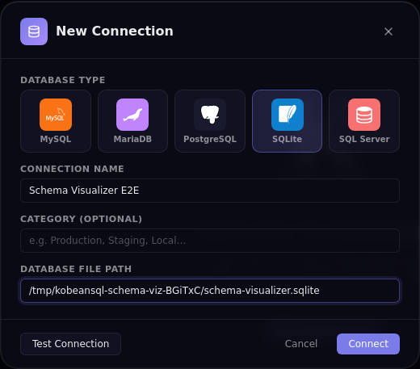
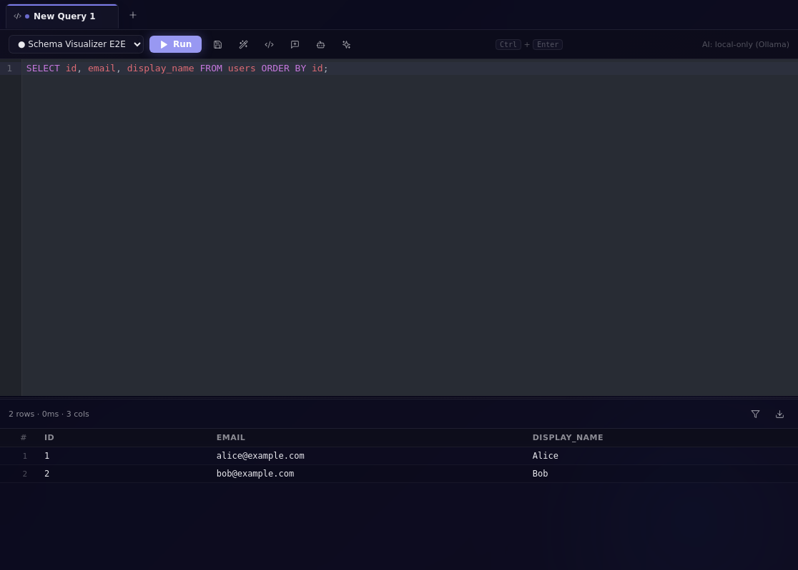
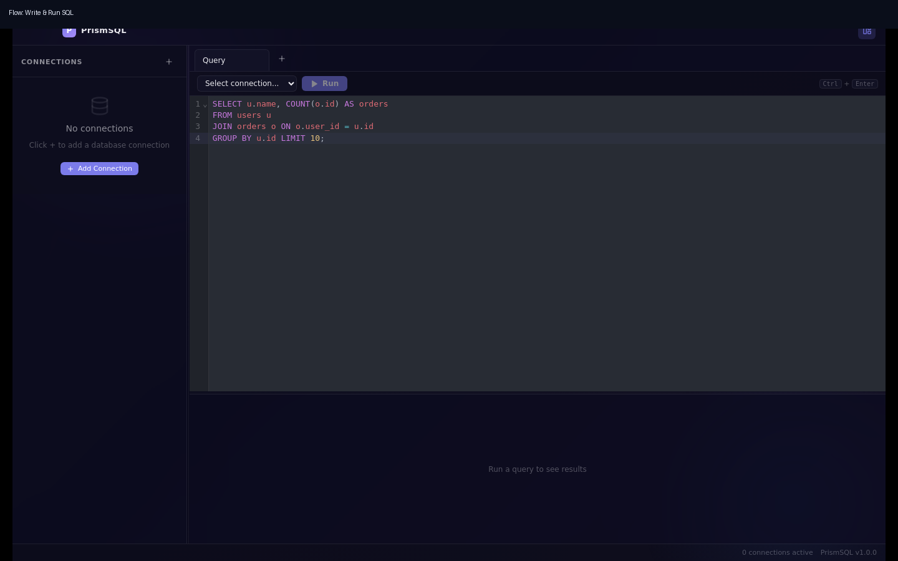

# KobeanSQL

A modern, high-performance SQL database client for desktop — built with **Electron**, **React**, and an **Apple-inspired glassmorphism UI**.


## 📸 Screenshots

### Add connection flow — test connection successfully, then save


### Querying data flow — run queries successfully and view results


### SQL editor flow — compose and run SQL


## ✨ Features

- **Apple Glassmorphism UI** — frosted-glass panels, backdrop blur, vibrancy (macOS), acrylic (Windows 11)
- **Multi-database support** — MySQL, MariaDB, PostgreSQL, SQLite, SQL Server (MSSQL)
- **Multi-tab query editor** — CodeMirror 6 SQL editor with syntax highlighting, autocompletion, and bracket matching
- **Schema browser** — expandable tree: connections → databases → tables/views → columns with types and PK flags
- **Results table** — sortable columns, global filter, CSV export, row count + query duration
- **Connection manager** — save, edit, delete and test connections; persisted across sessions
- **Connection import/export** — portable JSON backup/restore with validation and duplicate handling
- **SQL beautify** — one-click SQL formatting in the editor toolbar
- **Local AI providers** — Ollama and OpenAI-compatible local endpoints for generate/explain/optimize without cloud APIs
- **KobeanSQL SQL DSL** — dialect-aware query builders exposed in the Query Editor for common table/procedure/function SQL generation
- **Keyboard shortcuts** — `Ctrl/⌘+Enter` to run, `Ctrl/⌘+T` for new tab
- **Resizable layout** — drag sidebar and results-panel dividers

## 🗄️ Supported Databases

| Database     | Driver    | Default Port |
|-------------|-----------|-------------|
| MySQL        | mysql2    | 3306        |
| MariaDB      | mysql2    | 3306        |
| PostgreSQL   | pg        | 5432        |
| SQLite       | better-sqlite3 | —       |
| SQL Server   | mssql     | 1433        |

## ⬇️ Download

Pre-built installers for every platform are attached to each [GitHub Release](https://github.com/kobenguyent/KobeanSQL/releases/latest):

| Platform | File |
|----------|------|
| 🍎 macOS | `.dmg` / `.zip` |
| 🪟 Windows | `.exe` (NSIS installer / portable) |
| 🐧 Linux | `.AppImage` / `.deb` |

Head to the [Releases page](https://github.com/kobenguyent/KobeanSQL/releases/latest) and download the asset for your platform.

## 🚀 Getting Started

### Prerequisites

- **Node.js** ≥ 18
- **npm** ≥ 9

### Build from source

```bash
# Clone
git clone https://github.com/kobenguyent/KobeanSQL.git
cd KobeanSQL

# Install dependencies (skip native-module compilation at this stage)
npm install --ignore-scripts

# Rebuild native modules against Electron headers
npm run rebuild:sqlite
```

> **macOS — running a downloaded release:** The distributed app is not notarized with an Apple Developer certificate. After copying `KobeanSQL.app` to `/Applications`, strip the quarantine attribute so Gatekeeper allows it to open:
>
> ```bash
> xattr -cr /Applications/KobeanSQL.app
> ```

### Development

```bash
npm run dev
```

Opens the app in Electron with hot-reload for the renderer.

### Build

```bash
npm run build        # compile main + preload + renderer
npm run package      # build + create OS-specific installer
```

Packaged output lands in `dist/`.

> **macOS note:** CI builds are unsigned (no Apple Developer certificate). macOS Gatekeeper may block the app with *"KobeanSQL is damaged and can't be opened"*. To open it anyway, remove the quarantine attribute after mounting the DMG and copying the app to `/Applications`:
>
> ```bash
> xattr -cr /Applications/KobeanSQL.app
> ```
>
> Alternatively, right-click the app in Finder and choose **Open**, then confirm in the dialog.

## 🗂️ Project Structure

```
src/
├── main/                  # Electron main process
│   ├── index.ts           # BrowserWindow creation, app lifecycle
│   ├── store.ts           # JSON-based connection persistence
│   ├── ipc/index.ts       # IPC handler registration
│   └── db/
│       ├── adapter.ts     # DatabaseAdapter interface
│       ├── manager.ts     # ConnectionManager (pooling, routing)
│       └── adapters/      # Per-driver implementations
│           ├── mysql.ts
│           ├── postgres.ts
│           ├── sqlite.ts
│           └── mssql.ts
├── preload/
│   └── index.ts           # Secure contextBridge → window.db API
└── renderer/
    └── src/
        ├── App.tsx                     # Root layout
        ├── sql/dsl.ts                  # KobeanSQL SQL DSL builders
        ├── types/index.ts              # Shared renderer types
        ├── store/index.ts              # Zustand + Immer state
        ├── styles/globals.css          # Glassmorphism design system
        └── components/
            ├── ConnectionModal/        # Add / edit connection form
            ├── Sidebar/                # Connection + schema tree
            ├── TabBar/                 # Multi-tab navigation
            ├── QueryEditor/            # CodeMirror SQL editor
            └── ResultsTable/           # @tanstack/react-table results grid
tests/
├── types.test.ts       # DB_COLORS / DB_DEFAULT_PORTS constants
├── manager.test.ts     # ConnectionManager unit tests (mocked adapters)
└── store.test.ts       # Connection persistence (load/save JSON)
```

## 🧪 Tests

```bash
npm test          # run once
npm run test:watch  # watch mode
```

Tests use **Vitest** and mock all database drivers so no live server is needed.

## 🤖 Local AI (Provider-flexible, local-only)

KobeanSQL AI is designed with a strict **local-only** policy:

- Supported local providers:
  - **Ollama**
  - **OpenAI-compatible local servers** (e.g. LM Studio, LocalAI, llama.cpp server mode)
- No cloud AI provider integrations.
- No telemetry or analytics pipeline for AI prompts/results.
- Your prompts and SQL stay local to your machine.

### Setup

1. Choose and start a local provider:
   - Ollama default endpoint: `http://127.0.0.1:11434`
   - OpenAI-compatible default endpoint: `http://127.0.0.1:1234/v1`
2. Pull/load at least one model in your local provider.
3. Set provider env vars if needed (all URLs must use localhost/loopback).

Optional overrides:
- `KOBEANSQL_AI_PROVIDER` — `ollama` (default) or `openai-compatible`
- `KOBEANSQL_OLLAMA_URL` — override Ollama base URL (localhost/loopback only)
- `KOBEANSQL_OLLAMA_MODEL` — override default model name
- `KOBEANSQL_OPENAI_URL` — override OpenAI-compatible base URL (localhost/loopback only)
- `KOBEANSQL_OPENAI_MODEL` — override OpenAI-compatible model name

In the Query Editor toolbar you can use:
- **AI Generate** (from a natural-language prompt)
- **AI Explain** (explains current SQL)
- **AI Optimize** (returns improved SQL)

## 🧱 KobeanSQL SQL DSL

KobeanSQL ships with a small SQL DSL for generating common statements in a dialect-aware way. The app uses the same builders internally for schema actions, and the Query Editor now exposes them directly so you can generate boilerplate SQL without hand-writing database-specific syntax.

### Use the DSL in the Query Editor

1. Open a query tab and select a connection.
2. Click the **KobeanSQL DSL** (`</>`) button in the Query Editor toolbar.
3. Choose the statement type:
   - **Select table / view**
   - **Call procedure**
   - **Call function**
4. Enter the object name and, if needed, a schema or database qualifier.
5. For `SELECT`, choose the row limit.
6. Review the live SQL preview and click **Insert SQL**.

The generated SQL is inserted into the current tab, so you can keep composing by hand before running it.

### Dialect rules handled by the DSL

- **Identifier quoting**
  - SQL Server: `[identifier]`
  - MySQL / MariaDB: `` `identifier` ``
  - PostgreSQL / SQLite: `"identifier"`
- **Select builder**
  - SQL Server uses `SELECT TOP n * FROM ...`
  - PostgreSQL / MySQL / MariaDB / SQLite use `SELECT * FROM ... LIMIT n`
- **Routine builder**
  - Procedures use `EXEC ...` on SQL Server
  - Procedures use `CALL ...()` on PostgreSQL / MySQL / MariaDB / SQLite
  - Functions use `SELECT ...()` across supported dialects

### Programmatic API

The DSL lives in `src/renderer/src/sql/dsl.ts` and currently exposes:

- `quoteIdentifier(name, dbType)`
- `buildSelectTableSql(dbType, tableName, schemaOrDatabase, limit)`
- `buildProcedureCallSql(dbType, routineName, routineType, schema)`

Example usage:

```ts
import { buildProcedureCallSql, buildSelectTableSql, quoteIdentifier } from './src/renderer/src/sql/dsl'

const selectSql = buildSelectTableSql('postgres', 'users', 'public', 25)
// SELECT * FROM "public"."users" LIMIT 25;

const procedureSql = buildProcedureCallSql('mssql', 'syncUsers', 'procedure', 'dbo')
// EXEC [dbo].[syncUsers];

const quoted = quoteIdentifier('Order Details', 'mysql')
// `Order Details`
```

## 🧰 Connections: Import / Export

- Use the sidebar header buttons to import/export connection files.
- Import validates connection entries and applies conflict handling:
  - Replace on matching `id`
  - Skip exact duplicates (same connection fingerprint)
  - Skip invalid records
- Export defaults to omitting passwords for safer sharing.

## 🧾 Logging & Diagnostics

- KobeanSQL writes local logs using `electron-log`.
- Use the status-bar bug icon to open the logs folder quickly.
- When reporting issues, share relevant log excerpts and redact sensitive values.

## 🛠️ Tech Stack

| Layer        | Technology |
|-------------|------------|
| Shell        | Electron 29 |
| Build        | electron-vite + Vite 5 |
| UI           | React 18 + TypeScript |
| State        | Zustand + Immer |
| SQL editor   | CodeMirror 6 (@uiw/react-codemirror) |
| Data grid    | @tanstack/react-table |
| Icons        | lucide-react |
| DB drivers   | mysql2, pg, better-sqlite3, mssql |
| Tests        | Vitest |

## 📜 License

MIT © 2026 josephThien - kobet
